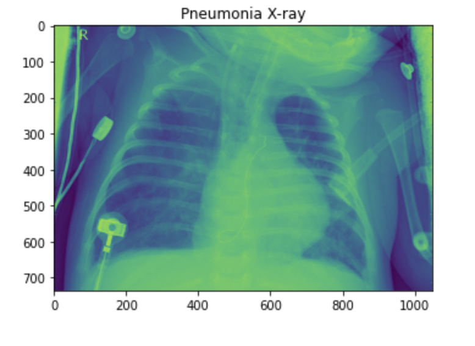

# Overview

Detecting Pneumonia with Deep Learning and Convolutional Neural Networks

Shares common symptoms with other conditions
Tests to diagnose pneumonia are great but they take days for results
A doctor can misdiagnose pneumonia from an X-ray
Failure to notice inflammation
Irregular pattern
Human error

# Data Analysis

I have 5216 pneumonia and normal x-ray images

## X-ray Images

I can't compare with normal and pneumonia x-rays

Discovering patterns with your naked eye is hard
It’s inconsistent 
Unable to confidently replicate 
Conflicting diagnoses may occur

## Normal X-ray

This is Normal X-ray

## Pneumonia X-ray

This is pneumonia X-ray

# Preprocessing

I transfomed the images to tensor (150,150,3)

# Train Model

## Model 1

I create first test model

## Model 2

I developed the model

# Conclusion

Our model is:

Thousands of times faster at predicting pneumonia than any doctor
3% more accurate than a doctor

More accessible than a doctor

Provides a mathematic approach to evaluating image data

Reading an X-ray is closer to getting blood work results with our model

notebook

presentation

github

